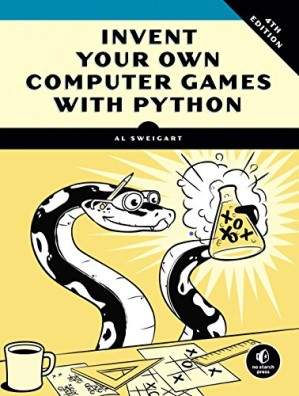
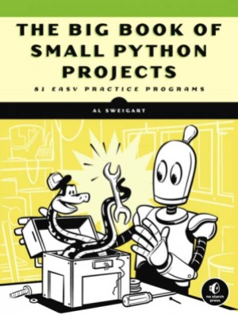

# Tiny python games 

### Project description:
#### Small games in Python, mostly console. A set of mini-games. All the code in the project is based on Al Sweigard's books (but with my changes and additions):
- "Invent your own computer games with Python" 

- "The Big Book of Small Python Projects"

Hope you'll enjoy!

### Project inspired by: ###

### Project technologies:

> Python 3 (I used Python 3.10)