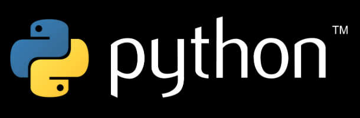

# Tiny python games 

### Project description:
#### Small games in Python, mostly console. A set of mini-games. All the code in the project is based on Al Sweigard's "Invent your own computer games with Python" book, but with my changes and additions. Hope you'll enjoy!

### Project inspirer:

### Project technologies:

> Python 3 (I used Python 3.10)